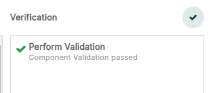
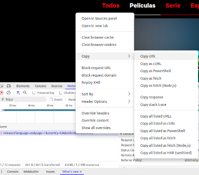
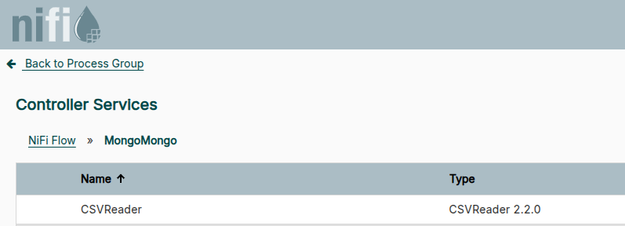

# 💧 Apache Nifi &mdash; 👣 Primeiros pasos

## Requisitos previos

Lembra seguir a [guía de instalación de Apache Nifi](docker-8-apache-nifi.md) antes de continuar con este documento.

Imos ver un par de exemplos simples para demostrar o funcionamento de Apache Nifi.

## Creando contedores coas bases de datos

Creamos un servidor de MySQL

``` bash
docker volume create mysql4nifi_vol

docker run -p 9906:3306 --name mysql4nifi \
    -v mysql4nifi_vol:/var/lib/mysql \
    -e MYSQL_ROOT_PASSWORD=Nifi.My456 \
    -e MYSQL_DATABASE=nifi \
    -e MYSQL_USER=nifi \
    -e MYSQL_PASSWORD=Nifi.Abc123 \
    --restart unless-stopped -d mysql:8
```

Conectamos á base de datos:

``` bash
docker exec -it mysql4nifi mysql -hlocalhost -unifi -pNifi.Abc123 nifi
```

E pegamos o script:

``` sql
CREATE TABLE tronoPers(
    id INTEGER,
    firstName VARCHAR(100),
    lastName VARCHAR(100),
    fullName VARCHAR(100),
    title VARCHAR(100),
    family VARCHAR(100),
    image VARCHAR(255),
    imageUrl VARCHAR(255)
);

CREATE TABLE tronoCont(
    id INTEGER,
    name VARCHAR(100)
);

CREATE TABLE estrenosNet(
    videoID INTEGER,
    country CHAR(2),
    title1 VARCHAR(255),
    title2 VARCHAR(255),
    startTime TIMESTAMP,
    collection INTEGER,
    image TEXT,
    genre INTEGER
);
```

⚠️ **Non copies e pegues os seguintes comandos sen ler.**

Tan so se tiveses que crear a BBDD e o usuario a man porque xa teñas o servidor MySQL creado, sería así:

``` sql
CREATE DATABASE nifi;
CREATE USER 'nifi'@'%' IDENTIFIED BY 'Nifi.Abc123';
GRANT ALL PRIVILEGES ON nifi.* TO 'nifi'@'%';
FLUSH PRIVILEGES;
use nifi;
```

### Lendo dúas APIs de exemplo

Imos facer dúas probas, unha cunha API chamada [ThronesAPI](https://thronesapi.com/) e outra real, a de [Netflix](https://about.netflix.com/es/new-to-watch).

#### ThronesAPI

A API de [ThronesAPI](https://thronesapi.com/) permítenos baixar directamente a información e ten documentación de uso.

Por exemplo, podemos arrastrar un novo procesador e seleccionar InvokeHTTP e nas propiedades empregar calquera das URL:

- <https://thronesapi.com/api/v2/Characters>
- <https://thronesapi.com/api/v2/Continents>

Dende o canvas de Nifi arrastramos un grupo de procesamento e lle chamamos *Trona2*. Facemos doble click dentro del para meternos e dentro do seu canvas arrastramos un procesador. No cadro de búsqueda poñemos que sexa de tipo: **InvokeHTTP**.

Facemos doble click no novo procesador InvokeHTTP e modificamos:

- Na lapela **Settings** cambiamos a súa propiedade **name** a **ThronesAPI**.
- Na lapela **Scheduling** deixamos o evento como Time driven, pero en **Run Schedule** mudamos os 0 segundos por **300 segundos**.
- Na lapela **Properties** mudamos o campo **HTTP URL** por: **https://thronesapi.com/api/v2/Characters**.
- Na lapela **Relationships** marcamos terminate nos casos: Failure, No Retry, e Retry.

Cando teñamos modificado todo, premeremos en Apply.

Facemos click dereito no procesador e seleccionamos **Change color** e poñemos unha cor vermella.

Volvemos a facer doble click no procesador e imos á lapela **Properties**, na parte superior dereita veremos Verification e un check ✔️.


Prememos no check para ver se o procesador supera todas as verificacións de debería verse todo en verde. Se tes algo mal, corríxeo antes de continuar. En xeral para case todos os controis, debemos primeiro aplicar e logo volver meternos e validar.

⚠️ **Lembra gardar os cambios antes de validar.** A maioría dos controis valídanse coa configuración anterior sen gardar a non ser que os gardemos explícitamente.




#### Netflix

Imos á páxina de [Netflix. New to Watch](https://about.netflix.com/es/new-to-watch) e prememos Ctrl+Shift+i para acceder á consola do desenvolvedor. Unha vez ahí imos a Network e despois filtramos por Fetch/XHR ([XMLHttpRequest](https://www.w3schools.com/xml/xml_http.asp)).


Despois cambiamos na web de lapela entre Películas e series por exemplo e veremos que aparece unha nova liña cunha petición. Facemos click dereito nela: *Copy* &rarr; *Copy URL*.



Se pegamos esa URL nunha nova lapela, veremos que nos da un JSON paxinado. Sen embargo, se tratamos de pegar esa URL no Nifi, dará un erro 403 (prohibido) xa que a web non permite que ferramentas automáticas se conecten a ela.

Podemos baixar o arquivo JSON a man e subilo a un servidor web noso para probar a descargalo dende ahí.

Ollo! Non tódolos datos que son públicos teñen licencia para ser empregados e voltos a publicar.

## Montar un servidor web para meter arquivos

Pode serche útil para non saturar os servidores dos que queiras baixarte información ou se che prohíben o acceso dende Nifi ou curl.

Con estes dous comandos crearás un directorio "web" dentro do teu home de usuario. Ahí poderás mover os documentos que queiras accesibles (por exemplo arquivos .json previamente descargados).

``` bash
mkdir -p $HOME/web

docker run --name nginx -p 80:80 \
  -v $HOME/web:/usr/share/nginx/html:ro \
  --restart unless-stopped -d nginx
```
## Conexión coas diferentes bases de datos

Imos ver un par de exemplos de conexión:

- **DBCPConnectionPool**: Para conectar por JDBC a unha base de datos relacional.
- **MongoDBControllerService**: Para conectar a MongoDB, unha BBDD NO-SQL.

### DBCPConnectionPool: Conexión coa BBDD

Os controles mínimos que precisamos para transformar de modo sinxelo os datos descargados dun servizo web en JSON e pasalos á nosa base de datos relacional son:


- Procesador **InvokeHTTP** / **GetFile** / **GetFileResource** / **...** /: Precisamos un procesador que nos devolva un JSON en formato **FlowFile**. As propiedades do exemplo son para o **InvokeHTTP**:
    - Lapela **Properties** &rarr; **HTTP URL**: https://thronesapi.com/api/v2/Characters
    - En **Relationships** en todo o que non sexa Response marca **Terminate**.
- Procesador **ConvertRecord**: Para pasar de JSON a CSV.
    - Lapela **Properties**:
        - Record Reader: Tres puntos &rarr; **Create New Service** &rarr; **JsonTreeReader**.
        - Record Writer: Tres puntos &rarr; **Create New Service** &rarr; **CSVRecordSetWriter**.
    - En **Relationships**, en **Failure** marca **Terminate**.
- Procesador **PutDatabaseRecord**: Para meter o Recordset na base de datos.
    - Lapela **Properties**:
        - Record Reader: Tres puntos &rarr; **Create New Service** &rarr; **CSVReader**.
        - Database Type: **MySQL**.
        - Statement Type: **INSERT**.
        - Database Connection Pooling Service: **DBCPConnectionPool**.
        - Table Name: **nifi**.
    - En **Relationships**, en **Failure** e **Retry** marca **Terminate**.

Precisamos saber a IP do servidor de base de datos:

``` bash
docker inspect mysql4nifi
```

Neste exemplo imaxinamos que é: **172.17.0.4**.

Para averiguar **Driver Class Name**, [se temos instalado DBeaver](dbeaver-tunel-ssh.md) podemos facer unha nova conexión de base de datos e premer en "Editar conexión", logo premeremos no botón "Driver settings" e miramos despois o nome de clase.

Agora teremos que facer click dereito no canvas (dentro do grupo de procesamento) e ir a **Controller Services** en **DBCPConnectionPool** configuraremos o seguinte:

- **Database Connection URL**: jdbc:mysql://172.17.0.4:3306/nifi
- **Database Driver Class Name**: com.mysql.cj.jdbc.Driver
- **Database Driver Location(s)**:
    - Para versión 8: /opt/nifi/compartido/jdbc/mysql-connector-j-8.4.0.jar
    - Para versión 9: /opt/nifi/compartido/jdbc/mysql-connector-j-9.2.0.jar
- **Database User**: nifi
- **Password**: Nifi.Abc123

Despois de aplicar os cambios, debemos meternos en cada un dos Controller Services facendo click nos tres puntos e logo en **Edit** e premer no check ao lado de **Verification**. Se todo funciona correctamente, prememos no botón **Close**, volvemos aos tres puntos e seleccionamos **Enable** e logo confirmamos con botón **Enable** de novo.

Para volver á pantalla anterior, prememos en **Back to Proccess Group**.



### MongoDBControllerService: Conexión con Atlas

Para poder conectar ao noso servicio de Mongo na nube (Atlas) teremos que configurar unha conexión.

Neste exemplo veremos un procesador **PutMongoRecord** conectado a través dun **MongoDBControllerService** a atlas a unha BBDD chamada nifi.


1. Conectamos a [atlas](https://www.mongodb.com/products/platform/cloud) &rarr; Sign In.
2. Se non temos un cluster gratuito, creámolo e engadimos o dataset de exemplo.
3. Imos a **Security** &rarr; **Network Access** e engadimos a IP externa saínte ou rango de IPs saintes **do servidor Apache Nifi**. Se non sabes qué IP de saída estás a empregar podes empregar calquera destes servizos:
    ``` bash
    curl ifconfig.me
    curl icanhazip.com
    curl api.ipify.org
    ```
4. En **Security** &rarr; **Database Access** &rarr; Prememos no botón **Add new database user** e seleccionamos:
    1. **Authentication Method**: Password.
    2. **Password authentication** &rarr; Escollemos un usuario e un contrasinal.
    3. **Builtin role** &rarr; **Atlas Admin**. Esto farémolo como proba, máis deberíase seleccionar só a base de datos a que necesitemos ter acceso e os permisos necesarios (lectura, escritura, ambos...).
    4. Marcamos **temporary user** e lle damos **6 horas** de duración ao usuario.
    5. ⚠️ Cando teñas todo configurado e funcionando, deberás volver aquí e crear un usuario definitivo con acceso ás bases de datos que precises.
5. En **Cluster** &rarr; Botón **Connect** &rarr; Prememos na opción **Drivers** &rarr; E copiamos o servizo sen usuario e contrasinal que será de tipo: 
    ``` 
    mongodb+srv://NomeElexidoPorTi.SubdominioAleatorio.mongodb.net
    ```
6. Imos a **Cluster** &rarr; **Browse collections**. Logo prememos no botón **+ Create Database**. Poñemos en **Database Name** *nifi* e en **Collection** *proba*.
7. En Apache Nifi arrastramos un novo procesador de tipo: **PutMongoRecord**.
    1. En **Client Service** &rarr; Nos tres puntos &rarr; **+ Create New Service**... &rarr; *MongoDBControllerService*.
    2. **Mongo Database Name**: *nifi*.
    3. **Mongo Collection Name**: *nomeDaColeccion*.
    4. **Record Reader**: *JsonTreeReader*.

## Ligazóns para mais información

- Titorial de Tutorial's Point: <https://www.tutorialspoint.com/apache_nifi/index.htm>
- Documentación oficial. Inicio rápido: <https://nifi.apache.org/docs/nifi-docs/html/getting-started.html>
- Documentación oficial. Manual do usuario: <https://nifi.apache.org/docs/nifi-docs/html/user-guide.html>
- Documentación oficial. Nifi en profundidade: <https://nifi.apache.org/docs/nifi-docs/html/nifi-in-depth.html>
- Titoriais en Youtube de InsightByte <https://www.youtube.com/playlist?list=PLkp40uss1kSI66DA_aDCfx02gXipoRQHc>