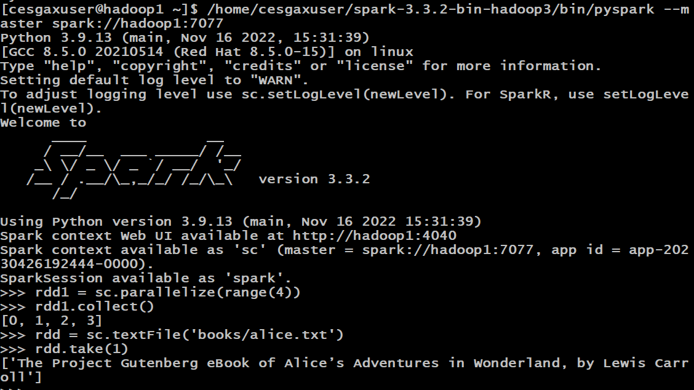

# 🧾 Apache Spark - Instalación

Con ClusterShell.

Instalaremos Spark e miraremos os procesos con permisos de administración:

``` bash
sudo yum --enablerepo=extras install epel-release
```

``` bash
sudo yum install clustershell
```

``` bash
clush -l cesgaxuser -bw hadoop[1-3] sudo rpm --import https://yum.corretto.aws/corretto.key
```

``` bash
clush -l cesgaxuser -bw hadoop[1-3] sudo curl -L -o /etc/yum.repos.d/corretto.repo https://yum.corretto.aws/corretto.repo
clush -l cesgaxuser -bw hadoop[1-3] sudo dnf install -y java-11-amazon-corretto-devel
```

``` bash
clush -l cesgaxuser -bw hadoop[1-3] sudo curl -L -O https://dlcdn.apache.org/spark/spark-3.3.2/spark-3.3.2-bin-hadoop3.tgz
```

``` bash
clush -l cesgaxuser -bw hadoop[1-3] sudo tar xzvf spark-3.3.2-bin-hadoop3.tgz
```

Copiamos el siguiente template y editamos el siguiente fichero:
``` bash
sudo cp /home/cesgaxuser/spark-3.3.2-bin-hadoop3/conf/spark-defaults.conf.template /home/cesgaxuser/spark-3.3.2-bin-hadoop3/conf/spark-defaults.conf
sudo nano /home/cesgaxuser/spark-3.3.2-bin-hadoop3/conf/spark-defaults.conf
```

Dentro metemos la siguiente línea:
``` bash
spark.master yarn
```

No nodo master executamos:
``` bash
sudo /home/cesgaxuser/spark-3.3.2-bin-hadoop3/sbin/start-master.sh
```

Nos nodos slaves executamos:

``` bash
clush -l cesgaxuser -bw hadoop[2-3] sudo /home/cesgaxuser/spark-3.3.2-bin-hadoop3/sbin/start-worker.sh spark://hadoop1:7077
```

## Instalar pySpark

Paso 1: Instalar python
``` bash
clush -l cesgaxuser -bw hadoop[1-3] sudo dnf install -y python39
```

## Lanzar pyspark

``` bash
/home/cesgaxuser/spark-3.3.2-bin-hadoop3/bin/pyspark --master spark://hadoop1:7077
```

## Configurar para que o worker arranque no inicio do servidor:

``` bash
sudo crontab -e
```

Pulsar tecla INS (para habilitar inserción de texto no editor vi) e escribir a liña:

```
@reboot /home/cesgaxuser/spark-3.3.2-bin-hadoop3/sbin/start-worker.sh spark://hadoop1:7077
```

E agora pulsar a tecla ESC e despois o texto (sen as comillas) ":wq!" e logo premer ENTER.

E no master o mesmo, pero con comando master:

``` bash
sudo crontab -e
```

E meter no arquivo:

```
@reboot /home/cesgaxuser/spark-3.3.2-bin-hadoop3/sbin/start-master.sh
```

hdfs dfs -mkdir /user/

 hdfs dfs -mkdir /user/cesgaxuser

 hdfs dfs -put hadoop-3.2.4.tar.gz

 hdfs dfs -ls

No nodo master:

crontab -e

e meter esta linea ao final para tamén iniciar yarn:

@reboot /home/cesgaxuser/hadoop-3.2.4/sbin/start-yarn.sh

sudo reboot

yarn top

En .bashrc debaixo de HADOOP_HOME, meter esta liña:

export HADOOP_CONF_DIR=${HADOOP_HOME}/etc/hadoop

En .bashrc, abaixo de todo, meter estas liñas ao final:

export SPARK_HOME=/home/cesgaxuser/spark-3.3.2-bin-hadoop3
export LD_LIBRARY_PATH=${HADOOP_HOME}/lib/native:$LD_LIBRARY_PATH

-----

Haberá que documentar (na práctica):

yarn top

yarn node -list

yarn application (-list/-kill)

jps -> De java (non spark ou hadoop)

------

Lanzar exemplos:

yarn jar hadoop-3.2.4/share/hadoop/mapreduce/hadoop-mapreduce-examples-3.2.4.jar wordcount "books/*" output

---

Configurando Spark para que funcione con Hadoop:

Editamos o arquivo .bashrc e lle engadimos ao final:

export PATH=$PATH:$SPARK_HOME/sbin/:$SPARK_HOME/bin/

Ao final do arquivo, depois de todas estas configuracións, debe quedar así:

JAVA_HOME='/usr/lib/jvm/java-11-amazon-corretto/'
export JAVA_HOME

HADOOP_HOME='/home/cesgaxuser/hadoop-3.2.4'
export HADOOP_CONF_DIR=${HADOOP_HOME}/etc/hadoop

export PATH=${PATH}:${HADOOP_HOME}/bin:${HADOOP_HOME}/sbin
export HADOOP_HOME

export EDITOR=nano

export SPARK_HOME=/home/cesgaxuser/spark-3.3.2-bin-hadoop3
export LD_LIBRARY_PATH=${HADOOP_HOME}/lib/native:$LD_LIBRARY_PATH
export PATH=$PATH:$SPARK_HOME/sbin/:$SPARK_HOME/bin/

Copiamos o arquivo de template por defecto de Spark para empregalo:

cp spark-3.3.2-bin-hadoop3/conf/spark-defaults.conf.template spark-3.3.2-bin-hadoop3/conf/spark-defaults.conf

Editamos o arquivo: spark-3.3.2-bin-hadoop3/conf/spark-defaults.conf

Metemos a liña:

spark.master                     yarn

Reiniciamos con clush tódolos nodos.

Executamos dende o master con spark-submit un traballo, que debería enviarse ao hadoop.

 spark-submit --deploy-mode client --class org.apache.spark.examples.SparkPi $SPARK_HOME/examples/jars/spark-examples_2.12-3.3.2.jar 2

Miramos nos logs de hadoop que se executara.

Dende o nodo master temos (por mor de clustershell) python 3.6 pero temos python 3.9 no resto de nodos.

Instalamos python3.9:

sudo dnf install python39

E metemos a versión 3.9 por defecto no master.

sudo /usr/sbin/alternatives --config python

sudo /usr/sbin/alternatives --config python3




Para ler arquivos do HDFS dende yarn/jupyterlab hai que poñer a ruta completa:

df = spark.read.csv("hdfs://host:9000/user/cesgaxuser/arquivo.csv")

Ollo! se probas dende pyspark, que acceda ao cluster e non cree un.
