# ☁️ OpenStack: Instancias

Imos aprender a lanzar unha ou varias instancias en Openstack, un contorno de nube/cloud empregado en varias empresas e tamén no [CESGA](https://www.cesga.es).

Se buscas **recuperar** unha instancia destruída en base a un volume gardado, consulta a sección **☁️ OpenStack: Volumes** &rarr; [Como lanzar unha instancia a partir dun volume](nube-2-openstack-volumes.md#como-lanzar-unha-instancia-a-partir-dun-volume).

## Configuración previa

### Acerca de Openstack

Por si tes curiosidade, Openstack ten moitos compoñentes, imos relacionarnos a través do interfaz web con todos eles, para que te fagas unha idea:

- **[Horizon](https://www.openstack.org/software/releases/caracal/components/horizon)**: O contorno de usuario (GUI). Básicamente o panel de control ou *dashboard* que manexamos.
- **[Keystone](https://www.openstack.org/software/releases/caracal/components/keystone)**: Provee autenticación mediante diversos mecanismos (como usuario e contrasinal). Soporta: LDAP, OAuth, OpenID Connect, SAML e SQL
- **[Nova](https://governance.openstack.org/tc/reference/projects/nova.html)**: Para acceso a recursos de computación. Unha especie de meta-hypervisor que soporta: KVM, LXC (libvirt), QEMU, VMWare, Virtuozzo, zVM e Ironic. Fonte: [docs openstack](https://docs.openstack.org/nova/latest/admin/configuration/hypervisors.html).
- **[Neutron](https://www.openstack.org/software/releases/caracal/components/neutron)**: Xestiona as diferentes redes.
- **[Designate](https://www.openstack.org/software/releases/caracal/components/designate)**: Servizo de DNS.
- **[Barbicam](https://www.openstack.org/software/releases/caracal/components/barbican)**: Ofrece almacenamento seguro de chaves, credenciais, certificados X509, chaves de cifrado...
- **[Ceilometer](https://www.openstack.org/software/releases/caracal/components/ceilometer)**: Para monitorizar os recursos e ver que pasa. Saca métricas e garda o emprego histórico de recursos.
- **[Cinder](https://www.openstack.org/software/releases/caracal/components/cinder)**: Provee almacenamento en bloques.
- **[Glance](https://www.openstack.org/software/releases/caracal/components/glance)**: Almacena e recupera imaxes do disco da máquina virtual. Permite recuperar os datos dende distintas ubicacións.
- **[Ironic](https://www.openstack.org/software/releases/caracal/components/ironic)**: Permite o aprovisionamento de recursos hardware directamente, máquinas virtuais ou contedores.
- **[Placement](https://www.openstack.org/software/releases/caracal/components/placement)**: Acceso API ao inventario e uso de recursos. Axuda a outros servizos a aprovisionar recursos.
- **[Swift](https://www.openstack.org/software/releases/caracal/components/swift)**: Permite o almacenamento de obxectos e provee de tolerancia a fallos.
- **[Octavia](https://www.openstack.org/software/releases/caracal/components/octavia)**: Balanceador de carga.
- **[AODH](https://www.openstack.org/software/releases/caracal/components/aodh)**: Servizo de alarmas. Provee disparadores e regras.
- **[Heat](https://www.openstack.org/software/releases/caracal/components/heat)**: Para orquestación.
- **[Magnum](https://www.openstack.org/software/releases/caracal/components/magnum)**: Fai posible a orquestación de: Docker Swarm, Kubernetes e Apache Mesos en Openstack. Emprega heat para orquestar o Sistema Operativo.
- **[Manilla](https://www.openstack.org/software/releases/caracal/components/manila)**: Provee de acceso coordinado ou compartido a sistemas de arquivos compartidos ou distribuidos.
- **[Trove](https://www.openstack.org/software/releases/caracal/components/trove)**: Provee de bases de datos como servizo (relacionais e non relacionais).
- **[Zaqar](https://www.openstack.org/software/releases/caracal/components/zaqar)**: Servizo de mensaxería.
- **[Mistral](https://www.openstack.org/software/releases/caracal/components/mistral)**: Servizo de workflow/fluxo de traballo. Permite ordear e executar pasos. Xestiona o estado, a orde correta de execución, paralelismo, sincronización e alta dispoñibilidade.
- **[Zun](https://www.openstack.org/software/releases/caracal/components/zun)**: Servizo de contendores a través de API.

Podes atopar máis información básica no [artigo de redhat de información básica acerca de Openstack](https://www.redhat.com/es/topics/openstack) e se queres facer unha instalación de Openstack, tamén podes consultar [este outro artigo en inglés de Daniel Persson](https://danielpersson.dev/2022/07/25/manually-install-openstack/).

### Partes do panel web **Horizon**

Antes de comezar lembra que debes **estar conectado á VPN** en caso necesario. No caso do CESGA, este panel de control está en: <https://cloud.srv.cesga.es> noutros casos de empresas que venden o servizo, debes crear o usuario de OpenStack antes de comezar.

Inicia sesión no panel de control.

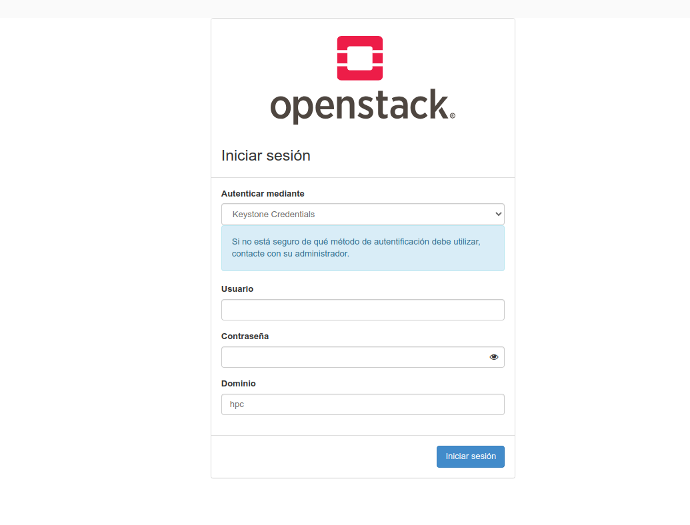

Se estás no contorno do CESGA lembra empregar o dominio `hpc` e autenticar mediante `KeyStone Credentials`.

ANtes de lanzar unha instancia é unha boa práctica e aforrarás traballo se creas antes un par de chaves e defines correctamente un grupo de seguridade.

### Creación do par de chaves

Imos conectar sen contrasinal, cun par de claves pública/privada. Podes ler máis información acerca delas en: [🔑 SSH e túneles](ssh-0-chaves-tuneles.md). Esta forma de conectar é o modo recomendado. Non se recomenda empregar contrasinais para conectar a servidores.

Temos dúas formas de crear este par de chaves. O habitual sería telas xa creadas e empregar o comando `ssh-keygen` dende GNU/Linux ou dende PowerShell en Microsoft Windows. Este comando encárgase xa de crear os arquivos de chave pública e privada cos permisos adecuados. Despois de creadas, poderíamos subir a chave pública (arquivo que rematará en .pub) que estaría dentro do directorio .ssh do noso directorio de usuario.

Sen embargo, desta vez, imos facer que nos autoxenere unha clave SSH o propio panel web. Unha vez iniciemos sesión imos á: **Computación &rarr; Pares de claves**.

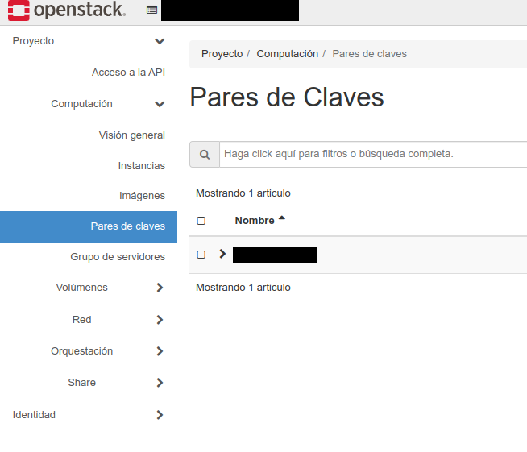

Nesta páxina podemos ver a lista de chaves (a parte pública) que podemos asociar na creación de instancias. As chaves que asociemos serán as que se poñan ao final do arquivo **📄 $HOME/.ssh/authorized_keys** para que poidamos conectar coas instancias que creemos.

Se queremos crear un par novo, prememos no botón "*Crear Par de Claves*" e seleccionamos en **"Tipo de clave"** a opción "*Clave SSH*" e en **Nombre de Par de Claves** un nome calquera que nos sirva para identificar a clave.

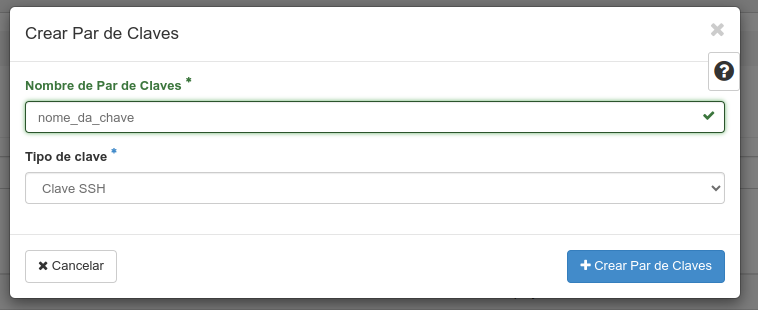

Esto debería baixarnos un arquivo co nome que lle teñamos dado rematado en .pem. Debemos gardalo, xa que contén a chave privada e non se poderá volver a baixar. O que se envía ao servidor é a parte pública da chave.

Podemos ter tantos pares de chaves como queiramos. É recomendable empregar ou ben un xestor de chaves como KeepassXC conectado a un axente e sincronizar as chaves entre os equipos que traballemos ou ben xerar unha chave por equipo.

### Creación do grupo de seguridade

Cando lanzamos unha instancia, esta debe ter un firewall. O grupo de seguridade é o equivalente na nube a este firewall.

Un grupo de seguridade ten un conxunto de regras de filtrado por protocolo, IP de orixe/destino e porto/s. Cada grupo de seguridade pode ter as súas propias regras.

Unha instancia ten alomenos un grupo de seguridade.

Imaxinemos un exemplo onde temos servidores de base de datos e servidores web. Probablemente non queiramos expoñer o porto 3306 dun MySQL a internet, pero si a algúns servidores web. Neste exemplo poderíamos crear dous grupos de seguridade:

- **Servidores_web**:
    - Porto **TCP 80** entrante aberto a *0.0.0.0/0*.
    - Porto **TCP 3306** saínte aberto a *0.0.0.0/0*.
    - Protocolo **ICMP** aberto a *0.0.0.0/0*.
    - Porto **TCP 22** aberto a: *172.18.0.1/24*.

- **Servidores_bbdd**:
    - Porto **TCP 3306** entrante aberto a *10.133.1.1/24*.
    - Protocolo **ICMP** aberto a *10.133.1.1/24* e *1.2.3.4/32*.
    - Porto **UDP 1194** aberto a *1.2.3.4/32*.
    - Porto **TCP 22** aberto a: *172.18.0.1/24*.

Para crear estes dous grupos de seguridade de proba, debemos ir a: **Red &rarr; Grupos de Seguridad**.

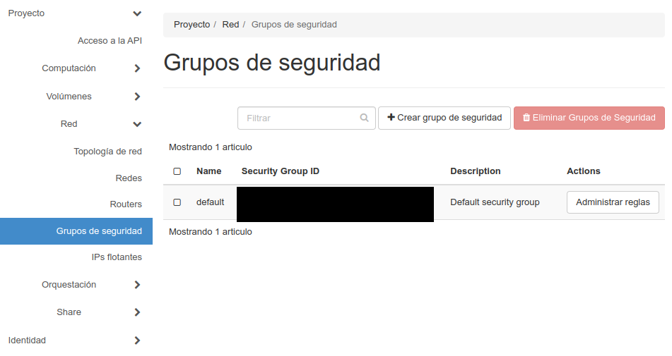

Prememos no botón: **➕ Crear grupo de seguridad**.

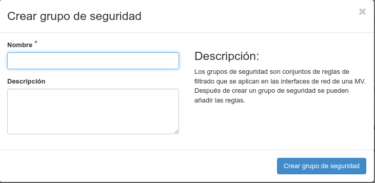

Por defecto creará dúas regras básicas que permiten todo o tráfico saínte, pero non o entrante. Hai que ter en conta ambos protocolos de rede: IPv4 e IPv6.

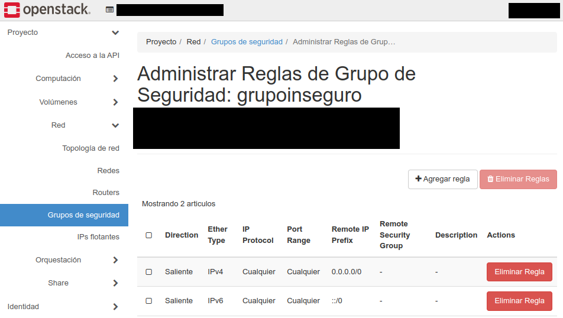.

Se queremos engadir unha nova regra, prememos no botón **Agregar regla**.

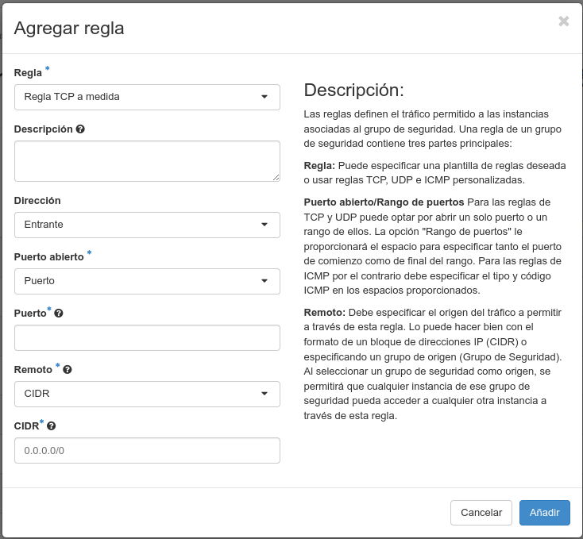.

Podemos elexir as opcións da dirección (entrante ou saínte) porto ou rango de portos e os remotos, que tamén poden ser outros grupos de seguridade.

Unha vez engadida a regra, podemos borrala, pero non editala.

## Lanzando unha ou varias instancias

Paso a paso

Computación &rarr; Instancias &rarr; Botón "Lanzar instancia"

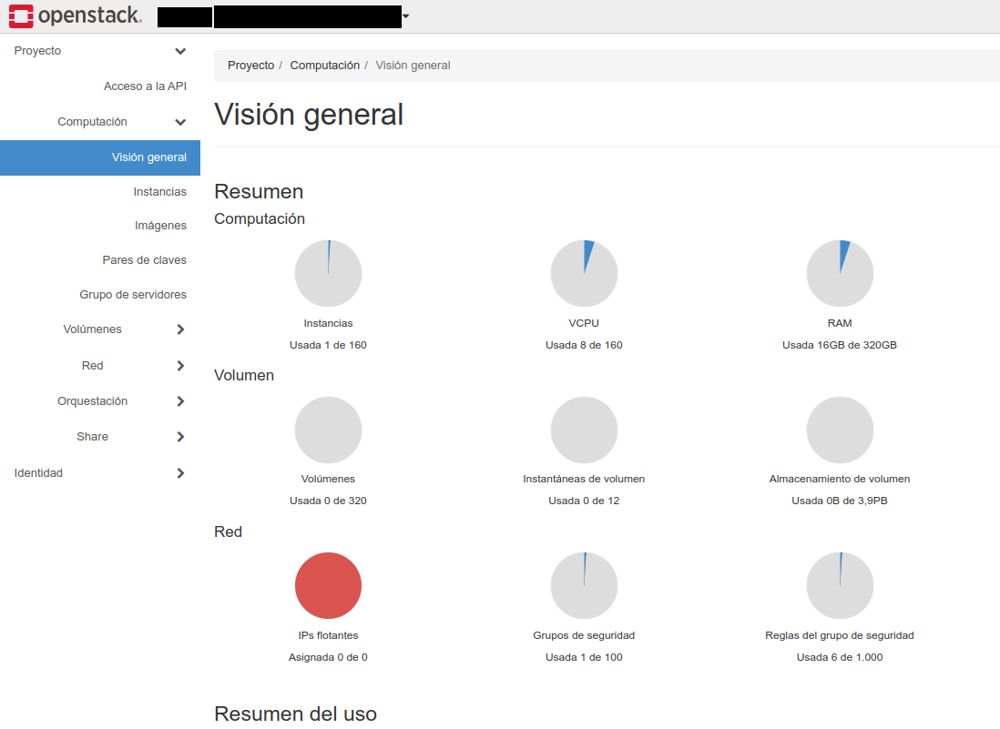

**Paso 1**: Nome da instancia, número de instancias a lanzar

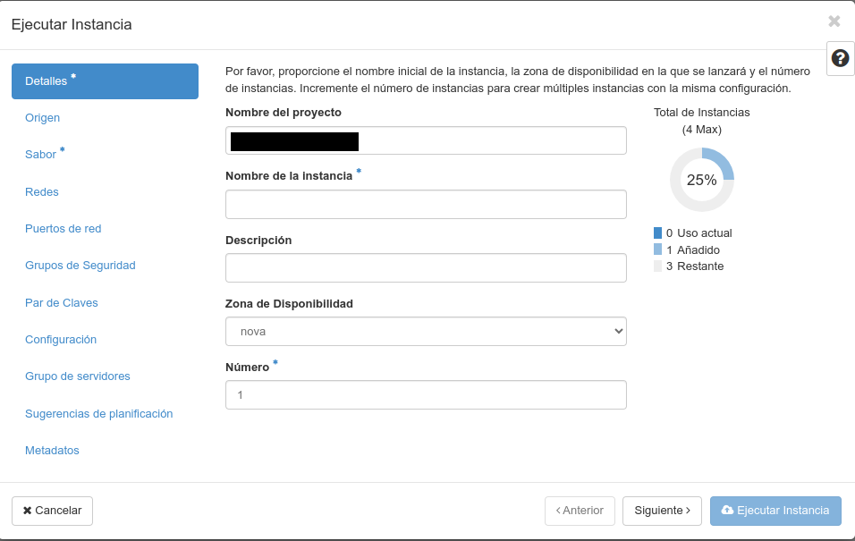

**Paso 2**: Escollendo a imaxe base

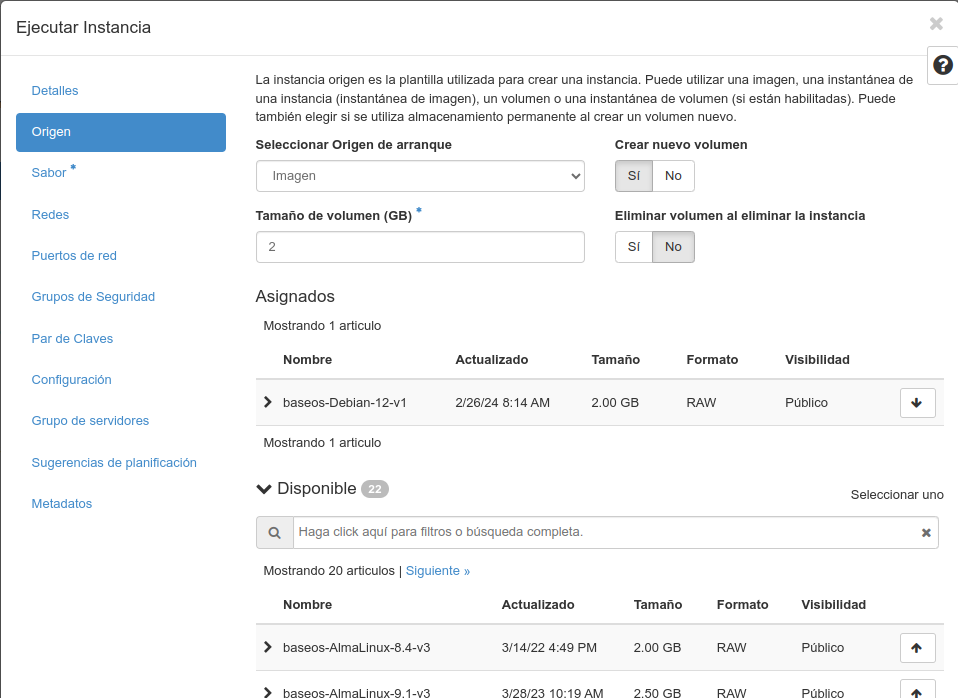

**Paso 3**: Sabor da instancia (recursos)

")

**Paso 4**: Redes ás que se conectará

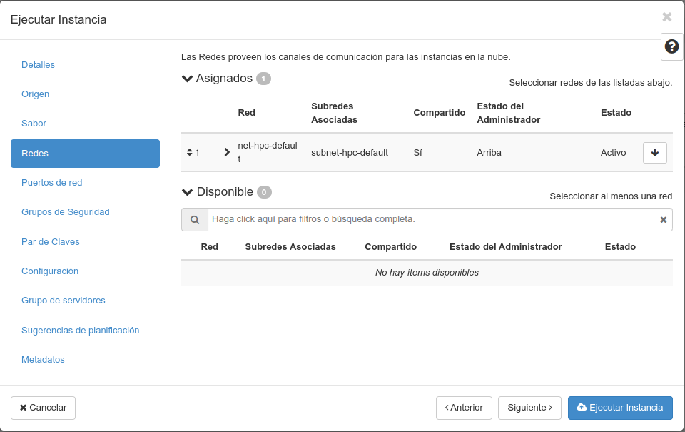

**Paso 5**: Portos de rede

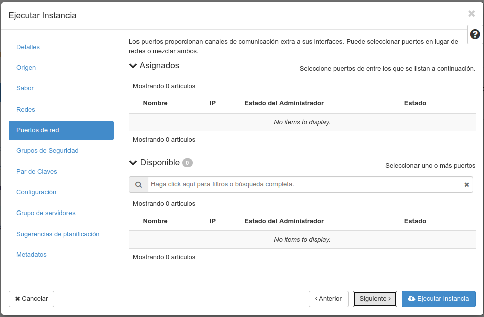

**Paso 6**: Grupos de seguridade

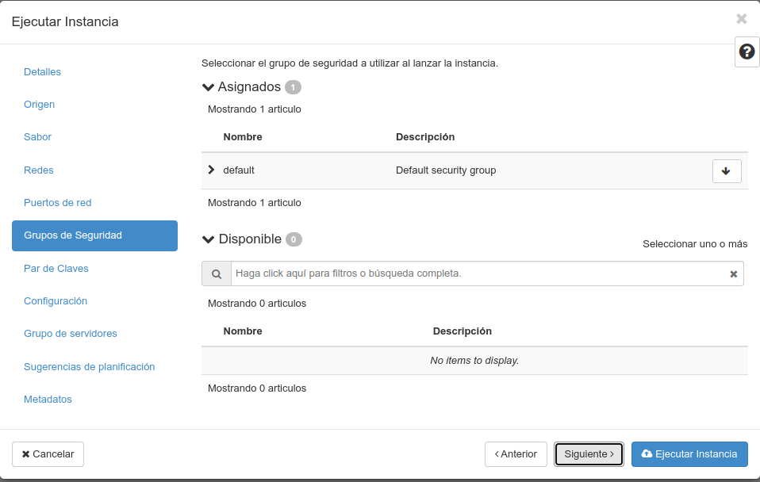

**Paso 7**: Autenticación. Elexindo o par de chaves

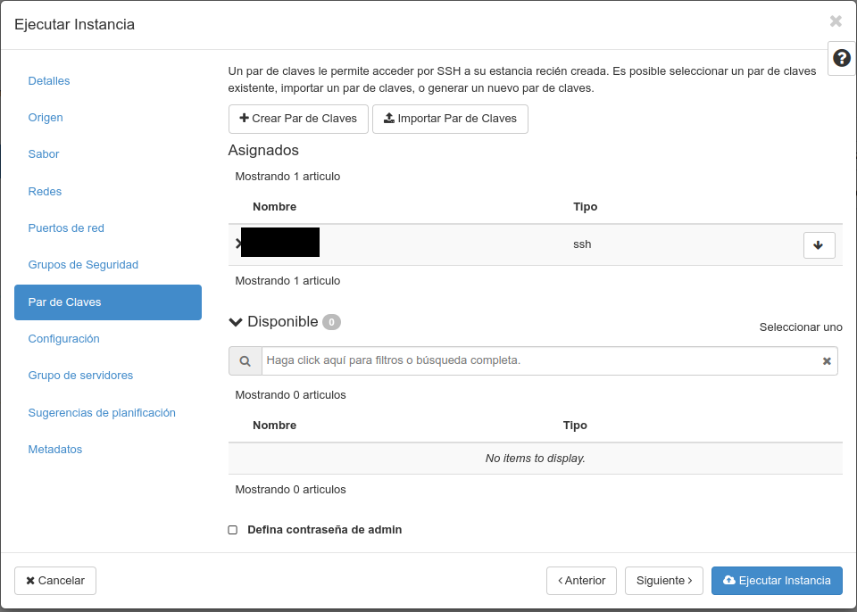

**Paso 8**: Script de configuración tras a instalación

**Paso 9**: Grupo de servidores

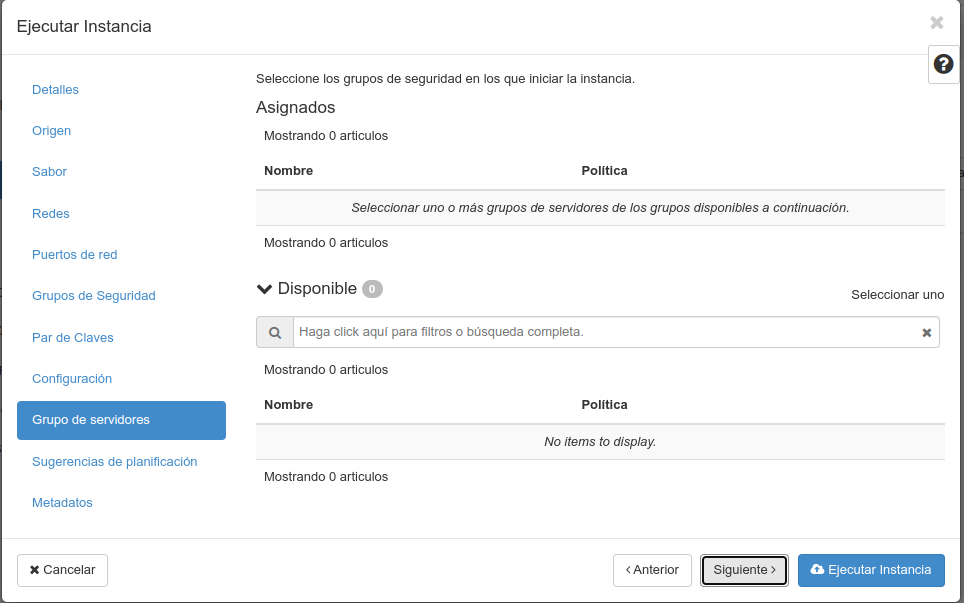

**Paso 10**: Sugerencias de planificación

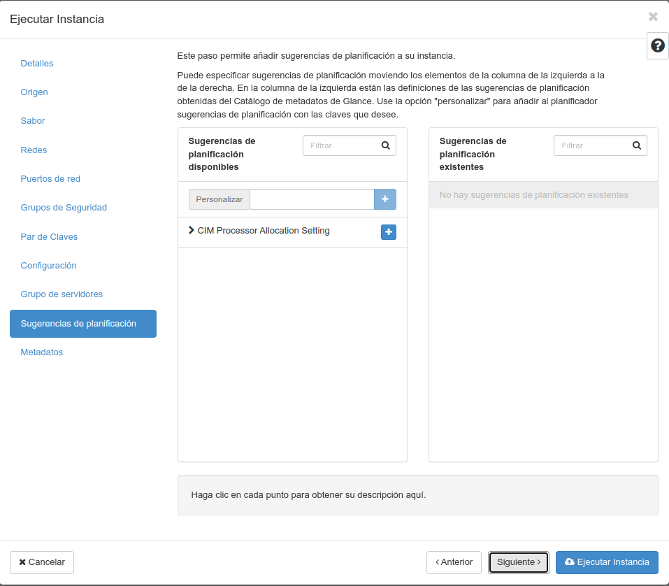

**Paso 11**: Metadatos e executar instancia

