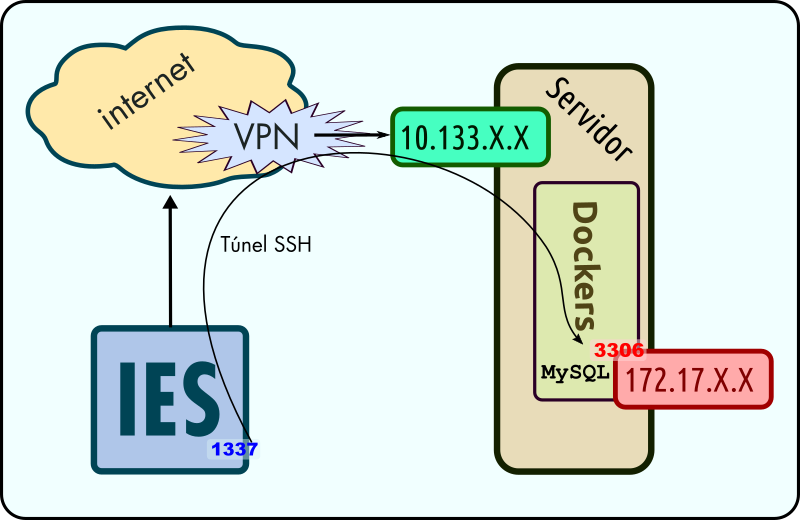

# 🔑 SSH e túneles sen cavar nin picar pedra
## ◼️ Qué é SSH

Un protocolo cifrado (**S**ecure **SH**ell) para conectar cun servidor e poder enviarlle comandos en modo texto. Permite moitas máis opcións, como por exemplo, redirixir portos.

## 🗝️ Xerar chave SSH

Hoxe en día deberíamos abandonar a autenticación por usuario e clave en prol dun método máis seguro, o cifrado asimétrico que emprega chave pública e privada.

Dentro do noso HOME (cartafol de usuario). Habitualmente en GNU/Linux: `/home/USUARIO` e en Microsoft Windows: `C:\Users\USUARIO`, debe existir un directorio/cartafol `.ssh` que pode conter o seguinte:

- 📁 ***.ssh***
    - 📄 **known_hosts**: Fingerprints dos servidores aos que nos temos conectado. A primeira vez que conectamos cun servidor, avísanos e nos amosa o fingerprint. Teóricamente deberíamos asegurarnos que é correcto para evitar ataques tipo MITM.
    - 📄 **authorized_keys**: Fingerprints das chaves públicas autorizadas a entrar no servidor.
    - 📄 **config**: Para non ter que empregar opcións ao conectar. Pódese empregar unha chave, usuario e redirección de portos diferente por cada host.
    - 🔑 **id_rsa**: Chave privada (non publicar e protexer por frase de paso) permite descifrar/asinar o que se cifrou coa chave pública.
    - 🔐 **id_rsa.pub**: Chave pública, pódese publicar e subir aos servidores. Débese engadir ao final do arquivo known_hosts para autorizar a nosa chave.

Se non existe, podemos facer unha das seguintes cousas para crealo:

- Tentar conectar con calquer servidor por SSH. Exemplo: `ssh localhost`.
- Xerar unha chave SSH: `ssh-keygen`.

### 🪟 Microsoft Windows

Abrimos PowerShell e executamos:

~~~~
ssh-keygen
~~~~

Vídeo de Youtube

### 🐧 GNU/Linux

Abrimos unha consola xterm ou similar e executamos:

~~~~
ssh-keygen
~~~~

Vídeo en ASCIINEMA

## 🚇 Tunelización SSH: Empregando SSH para redireccionar portos (SSH Port Forwarding)

Se precisamos acceder a un recurso que está detrás dun firewall ou ben non é accesible directamente pero ao que pode acceder un equipo que ten o servizo de SSH aberto e ao que nos podemos conectar, podemos crear un tunel SSH.

### ♵ Tipos de túneles

- **Locales**: Abren no noso equipo (no que executamos o comando SSH) un porto. O destino pode ser o mesmo host ssh (localhost) ou outro destino ao que ese servidor teña acceso.
- **Remotos**: Abren no porto do host SSH ao que nos conectamos. Podemos exportar un servizo local.
- **Dinámicos**: Creamos un [proxy](https://es.wikipedia.org/wiki/Servidor_proxy) socks que pode ser empregado por moitas aplicacións (por exemplo, un navegador).

### 🔲 Comandos

Nunha consola, chamando SSH directamente podemos facer:

~~~~
ssh teuser@10.133.X.X -L 1337:172.17.X.X:3306
~~~~

Sintaxe: **-L**: Indica **l**ocal. O número: 1337 representa o porto local que se abrirá no noso equipo. De conectamos a él, levaranos á IP: 172.17.X.X e porto 3306 a través do servidor ao que nos estamos a conectar.

