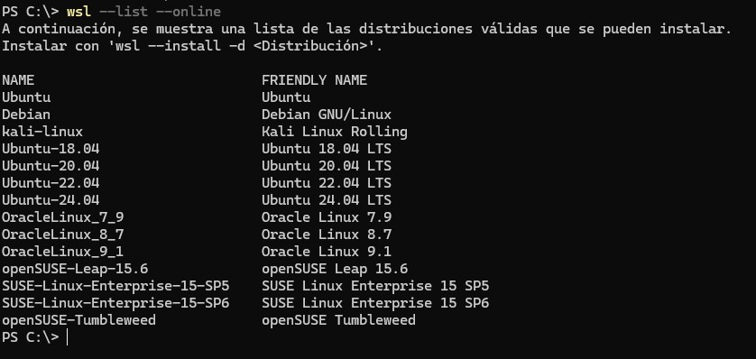

# 🐧 WSL &mdash; Windows Subsystem for Linux


Subsistema de Windows para Linux. Inicialmente foi concebido como unha capa de compatibilidade para executar programas de GNU/Linux (binarios **ELF**: **E**xtensible **L**inkable **F**ormat) en Microsoft Windows. Actualmente permite incluso executar o kernel real.

## 📝 Requisitos previos

Considérase unha máquina con Microsoft Windows 10/11.

## 🧾 Instalación

Require permisos de administrador ou root para instalar por primeira vez o compoñente no sistema.

Abrimos unha consola de PowerShell e escribimos o comando:

``` bash
wsl --install
```

Por defecto instalaranos unha máquina de Ubuntu.

Tras a instalación é preciso reiniciar, avísanos coa mensaxe: *La operación solicitada se realizó correctamente. Los cambios se aplicarán una vez que se reinicie el sistema.*.

Tras reiniciar, se non nos entra cun simple comando *wsl*, volvemos a unha consola de PowerShell **como usuarios** e volvemos escribir:

``` bash
wsl --install
```

Se queremos outro sabor de GNU/Linux podemos executar:

``` bash
wsl --list --online
```



E instalar a versión desexada, por exemplo:

``` bash
wsl --install -d Debian
```

**Recomendación 1**: Empregar systemd no inicio (para que inicie os demos/servizos):

``` bash
echo -e "[boot]\nsystemd=true"| sudo tee /etc/wsl.conf
```

**Recomendación 2**: Permitir o uso de máis memoria RAM
Podes crear no teu cartafol de usuario un arquivo **.wslconfig** que se aplicaría en global a tódalas máquinas ou ben poñer o seguinte contido no arquivo **/etc/wsl.conf** dentro de cada máquina.

``` bash
[wsl]
memory=12G
```
Podes atopar máis información e opcións de configuración do wsl en: <https://learn.microsoft.com/en-us/windows/wsl/wsl-config>

## 🔲 Comandos útiles

### Entrar no sistema

Abrimos unha consola de PowerShell e executamos:

``` bash
wsl
```

Para ver as distribucións instaladas:

``` bash
wsl -l
```

Se temos máis dunha distribución, debemos seleccionar cal queremos executar (ou executará a por defecto). Por exemplo:

``` bash
wsl -d Debian
```

Dentro da máquina entrará por defecto co usuario creado, con ese usuario podémonos facer root con comando sudo: ```sudo su```. Pedirache o contrasinal que elixiches ao crear a máquina, non o contrasinal da conta de Microsoft Windows.

### Apagar un WSL

``` bash
wsl --shutdown -d DISTRO
```

### Actualización de WSL

Abrimos unha consola de PowerShell e escribimos o comando:

``` bash
wsl --update
```

### Borrar unha distribución de WSL

Imaxinemos que queremos borrar a distribución **Ubuntu**:

~~~~ bash
wsl --unregister Ubuntu
~~~~

### Exportar e importar unha distribución

Pode ser útil gardar unha copia de seguridade dunha distribución e restaurala.

~~~~ bash
wsl --export Debian debian.tar
~~~~

Podemos borrar a distribución con: ```wsl --unregister Debian```

~~~~ bash
wsl --import Debian C:\Users\jose\distros\Debian C:\Users\jose\debian.tar 
~~~~

Normalmente a ruta de instalación por defecto adoita estar baixo: ```C:\Users\**USUARIO**\AppData\Local\Packages\TheDebian...```. Neste exemplo creamos dentro do cartafol de usuario outro chamado "distros" para localizar o arquivo de disco virtual **ext4.vhdx** máis fácilmente.

Ollo, se WSL non detecta o usuario tras unha importación do sistema, devolveranos unha consola de root.

## 📂 Acceso aos arquivos

Podemos acceder aos arquivos dentro do WSL dende Microsoft Windows. Abre un explorador de arquivos e no enderezo, introduce: **\\wsl$\DISITRIBUCIÓN**. Exemplo con Ubuntu:

~~~~
\\wsl$\Ubuntu
~~~~

Os arquivos gárdanse nun ficheiro .vhdx dentro do cartafol: %LOCALAPPDATA%\Packages\ nese cartafol localizamos a nosa distribución: TheDebian... ou CanonicalGroupLimited.Ubuntu... e dentro do cartafol da distro en: **LocalState**.

## ⚠️ Erros comúns

### Erro CreateProcessParseCommon

~~~~
<3>WSL (10) ERROR: CreateProcessParseCommon:711: Failed to translate X:\
~~~~

Trata de executar os comandos de WSL na unidade por defecto onde está instalado o sistema operativo (habitualmente C:\).

### Erros: 0x80370102 ou 0x8007019e (WslRegisterDistribution)

~~~~
WslRegisterDistribution failed with error: 0x80370102
Please enable the Virtual Machine Platform Windows feature and ensure virtualization is enabled in the BIOS.
For information please visit: https://aka.ms/enablevirtualization
Press any key to continue...
~~~~

Teremos que asegurarnos que:

1. Virtualización activada na BIOS.
2. Dependendo do SO:
    1. Para **Microsoft Windows 10**: En *"Inicio"* -> *"Aplicaciones y características"* -> *"Programas y características"* -> *"Activar o desactivar las funciones de Windows"* -> En *"características"*.
    2. Para **Microsoft Windows 11**: *"Inicio"* -> *"Activar o desactivar las características de Windows"*.
3. Busca a *"Plataforma de máquina virtual"* e mira que estea seleccionada.
4. Busca o *"Subsistema de Windows para Linux"* e mira que estea seleccionado.
5. Preme en aceptar e reinicia o equipo.

### Erro: Non inicia os demos/servizos

Hai que indicarlle que empregue systemd: 

``` bash
echo -e "[boot]\nsystemd=true"| sudo tee /etc/wsl.conf
```

Se segue sen funcionar, compre actualizar wsl:

``` bash
wsl --update
```
